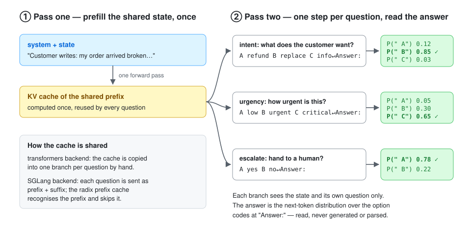

# How it works

LitJev reads candidate scores from the model's output head and builds typed
responses in Python: no generated JSON, no answer-text parsing, and no generated
answer tokens.



## Content readout (default)

1. **Shared prefix:** every row starts with the same state and generic
   instructions. SGLang's prefix cache computes it once; see below for
   transformers.
2. **One prompt per question:** the question's instructions and its options,
   listed as plain lines with no label in front of them, ending with `Answer:`.
   An option containing a line break is put on one line, in the listing and the
   scoring alike, and the count is recorded as `rewritten_options`.
3. **Readout:** each option's own text is appended after `Answer:` and
   teacher-forced. Its score is the summed log-probability of its tokens. The
   option is tokenised together with the prompt and checked to be separable from
   it; a tokenizer that merges across that boundary is refused, never guessed.
4. **Typed response:** a softmax over the option scores gives the probabilities,
   and the JSON is built in code.

The reason for scoring content: a single-token letter code carries a prior of its
own, and that prior lands on whichever option sits in the slot, so answers drift
towards some positions whatever they say. Scoring the option's words leaves no
label to prefer. Listing order can still matter and is not assumed away.

The cost is one short continuation per option rather than one position per
question. Nothing is sampled either way.

**Normalisation.** The default ranks options by `sum`, the joint log-probability.
`mean` (per token) and `pmi` (sum minus the same option's score after a
content-free question, which needs one extra pass) are available to engines built
in Python with `SchemaDecisionEngine(..., normalisation=...)`. `sum` favours short
options and `mean` long ones; `sum` was the more length-neutral of the two within
a question in our runs. Every result records the readout and normalisation it
was produced under.

On the transformers backend the k option rows of a question go through one
batched forward pass, each row carrying the prefix. With `--backend sglang` each row is one request sent as
token ids, so nothing is re-tokenised across the option boundary, and the
engine's prefix cache skips the shared part. The log-probabilities come back as
`input_token_logprobs` and are matched to the option by token id, not by offset.

Screenshot states always use the coded readout, because the content prompt is
text only. The diagnostics name the readout that actually ran.

## Coded readout (`--readout coded`)

The original readout, and the one every published games number and every
trained decision head so far was produced under.

1. **Shared prefill:** encode only the state and generic instructions once.
2. **Cached branches:** replicate KV/recurrent states and batch each question's
   instructions and criteria in a second forward pass, ending with `Answer:`.
   Original option keys map to internal letter codes (A–Z, then eligible
   AA…ZZ/AAA…ZZZ), verified as single tokens at this boundary. Unsupported
   tokenizers are rejected, never truncated.
3. **Readout:** take `output.logits[i, len(suffix_ids[i]) - 1, candidate_ids[i]]`.
   For Qwen, these are vocabulary-head (`lm_head`) logits after the final decoder
   normalization, at the final input position (the colon for Qwen), predicting
   a space-prefixed internal code token. These codes are not generated.
4. **Typed response:** normalize candidate logits, select the maximum, and build
   JSON in code. No autoregressive answer generation is performed.

On SGLang each question is sent as the shared prefix plus its own suffix, and
the candidate-code logprobs come back through `token_ids_logprob`. See
[the README](../README.md#serving-through-sglang).

Branches cannot see one another's questions or results. Renaming a question ID
does not change its model input. This schema migration changes the prompt compared
with the original catalog-based version, so historical accuracy, calibration profiles
and latency numbers must not be applied to it without re-evaluation.

## Relationship to Jev

LitJev is a hypothesis-based reproduction of Jev's decision layer from public
information. It is not a connection to the official Jev API, and it does not
reproduce Jev's training or proprietary internals.

- `/v1/systemone` follows the public `model / state / questions` request and typed
  response shapes, including structured criteria. See the [migration matrix](jev-schema.md).
- Jev's exact confidence formula is not published in the referenced docs. LitJev
  uses normalized Gini concentration: `(K * sum(p_i²) - 1) / (K - 1)` for K > 1,
  and 1 for a single option. Uniform distributions yield 0, point masses yield 1.
  This is **not max probability**, not an accuracy estimate, and not a claim of
  numerical parity with Jev.
- No RLCD training, learned correctness head, or one-forward guarantee is provided.

References: [TypeSafe documentation](https://docs.typesafe.ai/introduction) and the
[RLCD reference implementation](https://huggingface.co/harshatheg/Qwen-2.5-1B-RLCD).
These are independent external projects, not endorsements.

## Calibration

Probabilities are **not calibrated by default**. Debug diagnostics report
`calibration_fitted=false`, and normalization does not establish calibration.
Optional post-hoc temperature fitting is available:

```bash
# With the uncalibrated server running:
uv run litjev-mmlu --split validation --limit 70 --export-logits validation-logits.jsonl
uv run litjev-calibrate validation-logits.jsonl --model Qwen/Qwen3.8-27B --output calibration.json
# Stop the old server, then restart with the profile:
uv run litjev --model Qwen/Qwen3.8-27B --calibration calibration.json
```

Never fit on test labels. Keep model revision, prompt, option order, and evaluation
protocol fixed. A fitted temperature does not guarantee calibration on another
population or safe out-of-distribution routing. Do not use this preview as the sole
authority for consequential actions.

## Requirements and hardware

- Python 3.11+ and uv.
- Tested hardware: one NVIDIA H100 80 GB, BF16. Budget roughly 54 GB for 27B BF16
  weights alone, plus runtime overhead and branch caches. An 80 GB GPU is the tested
  starting point for 27B, not a general minimum; smaller Qwen checkpoints need less.
- Linux uses the locked PyTorch CUDA 12.8 distribution and needs a compatible driver.
  Model downloads need additional disk space and network access.
- `--device-map auto` is the default. Multi-GPU/offload configurations are not
  benchmarked here. CPU-only 27B inference is not a supported performance target.

Server options: `--model`, `--revision`, `--dtype` (`bfloat16`, `float16`,
`float32`), `--device-map`, `--port`, `--calibration`, `--backend` (`transformers`,
`sglang`), `--readout` (`content`, `coded`). Run `uv run litjev --help`.
